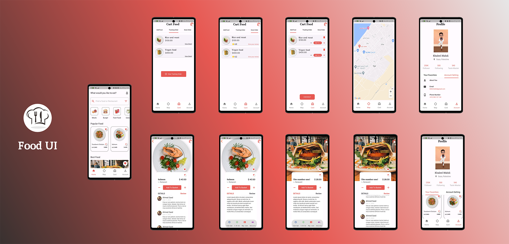

## Food App

This app for showcase my ability to build a food ui application 

## What this app contain:
- Home Model (Cofee menu)
- Nice Card Screen
- Home Page
- Google fonts (package)
- Google maps flutter (package)
- Geolocator (package)
* I didn't use any state management here "Only UI"

## How to use this app
- You can install application in your device via this repo
```bash
git clone https://github.com/klilmhdi/food-ui-app.git
cd food_ui_دapp
flutter pub get
flutter run
```
